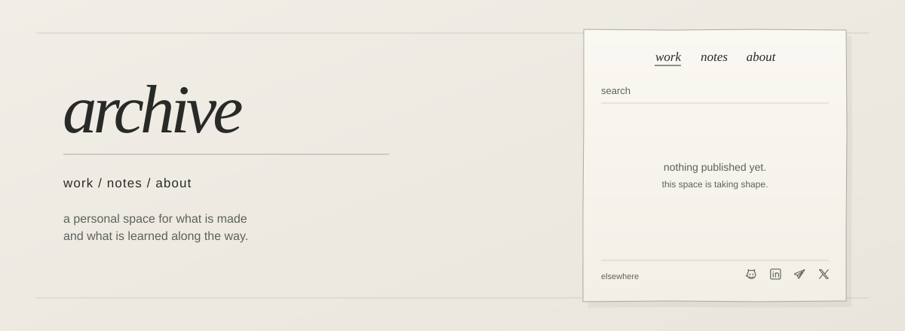
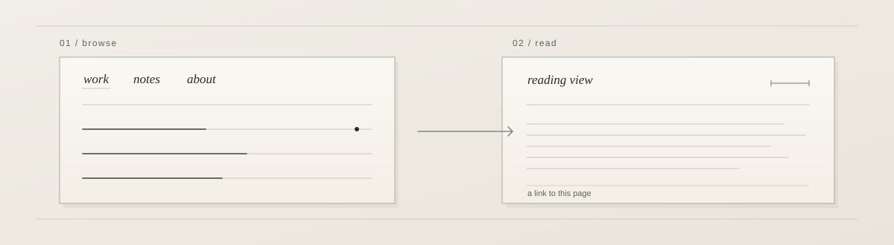
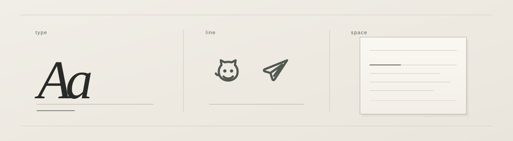

# archive

[visit the archive](https://maximkochergin.github.io/portfolio-board/)

`archive` is a personal portfolio and notebook. Work sits beside the notes behind it, with a little room for context in **about**. It is meant to grow over time while giving employers and collaborators a direct way to see what has been made.

## inside the archive

The board shows titles first. Open one to read the full piece or copy a link to that exact entry. Search helps find a piece later; the small line-drawn icons lead directly to external profiles. There is no separate contact page to navigate through.

## quiet by design

The paper-like board, restrained typography, and custom monochrome icons form one visual system. The greeting and visitor-local clock live around the board. Keyboard navigation, clear focus, screen-reader feedback, and reduced-motion support are built into the same experience.

Underneath is a small static frontend with Supabase-backed publishing. Posts have lightweight text formatting without rendering saved HTML as executable markup, and access to private writing is enforced by the database rather than by the appearance of the interface. Automated checks and a lightweight scheduled read support a site hosted on free services, without pretending that free-tier availability is guaranteed.

The greeting uses [Pencerio by Indian Type Foundry](./assets/fonts/FFL.txt). The illustration above follows the actual, currently sparse board rather than inventing finished portfolio pieces.
