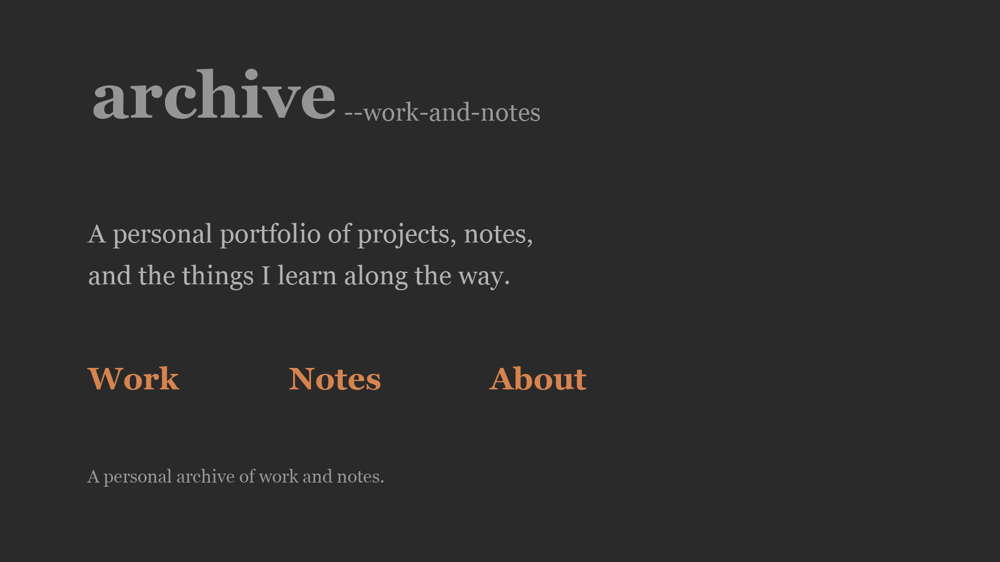

# archive

[Visit the archive](https://maximkochergin.github.io/portfolio-board/)

A personal portfolio and open notebook. Projects sit beside the notes behind them, with a little more context in **About**.

The site follows the dark version of [git-scm.com](https://git-scm.com/): a charcoal background, muted orange links, the same serif font stack, and compact text. There are no decorative dividers, oversized introductory headings, clocks, or greeting overlays.

## In the collection

- **Work, Notes, About:** independent sections with entry counts and search.
- **Reading:** dates, short previews, text formatting, and direct links to individual entries.
- **Owner workspace:** publish, save drafts, edit entries, and manage external links.
- **Owner sign in:** visible in the footer, with the direct [manage route](https://maximkochergin.github.io/portfolio-board/?manage=1) still available. Sign in uses an email link; sign out affects the current session.
- **Accessibility:** keyboard tabs, focus states, labelled forms, live feedback, reduced motion, and a responsive layout.

## Underneath

Static HTML, CSS, and vanilla JavaScript, backed by Supabase Auth and PostgreSQL. RLS protects private drafts and owner actions. Saved HTML stays inert text. GitHub Actions checks the site and deploys an explicit list of public files to GitHub Pages.

Run `npm run dev` for a local preview, `npm run check` for syntax checks, and `npm test` for behavior and server checks. See [setup and operation](./docs/SETUP.md) and [project context](./docs/PROJECT_CONTEXT.md).

The scheduled Supabase keepalive uses read-only requests. GitHub scheduling and free-tier services do not guarantee continuous availability.
